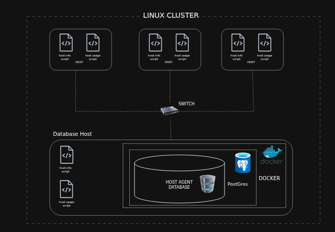

# Linux Cluster Monitoring Agent


# Introduction

The Linux Cluster Monitoring Agent (LCA) is a resource monitoring solution designed to track and record the hardware specifications and real-time usage statistics of Linux nodes within a server cluster. The system automatically collects CPU, memory, and disk data from each host and persists it to a centralized PostgreSQL database for historical analysis and reporting.

This project targets Linux cluster administrators and DevOps engineers who need visibility into how cluster resources are being consumed over time. It enables data-driven decisions around capacity planning, performance tuning, and infrastructure scaling.

The core technologies used include **Bash** for scripting and automation, **Docker** to provision and manage the PostgreSQL instance, **PostgreSQL** as the relational database for storing hardware data, **crontab** for scheduling recurring data collection, and **Git** for source control and deployment.

---

# Quick Start

**1. Start a psql instance using `psql_docker.sh`**
```bash
./scripts/psql_docker.sh start|stop|create [db_username] [db_password]
```

**2. Create tables using `ddl.sql`**
```bash
psql -h psql_host -U psql_user -d db_name -f sql/ddl.sql
```

**3. Insert hardware specs data into the DB using `host_info.sh`**
```bash
./scripts/host_info.sh psql_host psql_port db_name psql_username psql_password
```

**4. Insert hardware usage data into the DB using `host_usage.sh`**
```bash
./scripts/host_usage.sh psqlhost psql_port db_name psql_username psql_password
```

**5. Crontab setup**
```bash
# Edit crontab
crontab -e

# Add the following entry to collect usage data every minute
* * * * * bash /path/to/scripts/host_usage.sh psqlhost psql_port db_name psql_username psql_password &> /tmp/host_usage_$(date).log
```

---

# Implementation

## Architecture

The cluster consists of three Linux host nodes. Each node runs a monitoring agent (the bash scripts) that collects local hardware data. All agents write to a single centralized PostgreSQL database instance that is containerized via Docker and hosted on one of the nodes.


---

## Scripts

### `psql_docker.sh`
Manages the lifecycle of the PostgreSQL Docker container. Supports three operations: `create` provisions a new container with the given credentials, `start` brings an existing container back online, and `stop` shuts affromention container down.

```bash
# Create a new container
./scripts/psql_docker.sh create [db_username] [db_password]

# Start an existing container
./scripts/psql_docker.sh start

# Stop a running container
./scripts/psql_docker.sh stop
```

---

### `host_info.sh`
Collects static hardware specifications from the current host — including CPU model, number of cores, total memory, and disk size — and inserts a single row into the `host_info` table. This script is intended to be run **once** at provisioning time for each new node added to the cluster.

```bash
./scripts/host_info.sh psql_host psql_port db_name psql_username psql_password
```

---

### `host_usage.sh`
Collects dynamic runtime metrics from the current host — including memory free, CPU idle percentage, disk I/O, and disk available — and inserts a timestamped row into the `host_usage` table. This script is designed to be called repeatedly via crontab.

```bash
./scripts/host_usage.sh psqlhost psql_port db_name psql_username psql_password
```

---

### `crontab`
The crontab entry schedules `host_usage.sh` to execute once per minute on each monitored host. Logs are written to `/tmp/host_usage_$(date).log` for debugging purposes.

```bash
* * * * * bash /path/to/scripts/host_usage.sh psqlhost psql_port db_name psql_username psql_password &> /tmp/host_usage_$(date).log
```

---

### `queries.sql`
Contains analytical SQL queries that address the following business problems:

- **Cluster resource planning:** Identifies which hosts have insufficient memory relative to the rest of the cluster, helping administrators decide where to allocate new workloads.
- **Node failure detection:** Flags hosts that have not submitted a usage report within the expected interval, which may indicate agent failure or host downtime.

---

## Database Modeling

### `host_info`

Stores static hardware metadata for each node. Populated once per host at setup time.

| Column             | Data Type  | Description                                      |
|--------------------|------------|--------------------------------------------------|
| `id`               | SERIAL     | Auto-incremented primary key                     |
| `hostname`         | VARCHAR    | Fully qualified hostname of the node             |
| `cpu_number`       | INT2       | Number of logical CPU cores                      |
| `cpu_architecture` | VARCHAR    | CPU architecture (e.g., x86_64)                  |
| `cpu_model`        | VARCHAR    | CPU model name string                            |
| `cpu_mhz`          | FLOAT8     | CPU clock speed in MHz                           |
| `l2_cache`         | INT4       | L2 cache size in KB                              |
| `total_mem`        | INT4       | Total installed memory in KB                     |
| `timestamp`        | TIMESTAMP  | Time the hardware info was recorded              |

---

### `host_usage`

Stores time-series resource usage snapshots collected every minute from each host.

| Column              | Data Type | Description                                        |
|---------------------|-----------|----------------------------------------------------|
| `timestamp`         | TIMESTAMP | Time of the usage snapshot                         |
| `host_id`           | SERIAL    | Foreign key referencing `host_info.id`             |
| `memory_free`       | INT4      | Available free memory in MB                        |
| `cpu_idle`          | INT2      | Percentage of CPU time spent idle                  |
| `cpu_kernel`        | INT2      | Percentage of CPU time spent in kernel mode        |
| `disk_io`           | INT4      | Number of disk I/O operations in progress          |
| `disk_available`    | INT4      | Available disk space on root partition in MB       |

---

# Test

Each bash script was tested manually on a single Linux host before being deployed across the cluster. The process was as follows:

1. **`psql_docker.sh`** — tested all three flags (`create`, `start`, `stop`) in sequence, testing positive cases and negative cases, verifying container state with `docker ps` after each call. 
2. **`ddl.sql`** — executed against the live psql instance and confirmed both tables were created using `\dt` in the psql shell.
3. **`host_info.sh`** — ran the script and queried the `host_info` table directly to confirm the row was inserted with correct values matching `lscpu` output.
4. **`host_usage.sh`** — ran the script multiple times and verified that new rows were being appended to `host_usage` with incrementing timestamps and log files were generateed with accurate time stamps.
5. **Crontab** — verified the crontab entry was active, waited two minutes, and confirmed two new rows had been inserted into `host_usage`.

All tests passed with the expected data populated in the database.

---

# Deployment

The application was deployed as follows:

- **Docker** provisions and hosts the PostgreSQL instance on a designated node within the cluster. The container is started automatically as part of the setup process using `psql_docker.sh create db_user db_password`.
- **GitHub** is used for version control. All scripts, SQL files, and documentation are committed to a repository, enabling easy distribution to each cluster node via `git clone`.
- **Crontab** is configured on each individual Linux host to schedule `host_usage.sh` at one-minute intervals, ensuring continuous and automated data collection without any manual intervention after setup.

---

# Improvements

- **Handle hardware updates:** If a node's hardware is upgraded (e.g., more RAM added), the `host_info` table should be updated to reflect the new specs rather than remaining stale with the original values.
- **Automated agent provisioning:** Currently, each host must be set up manually. A provisioning script or configuration management tool (e.g., Ansible) could automate the deployment of the monitoring agent across all nodes simultaneously.
- **Alerting on anomalies:** Add a notification mechanism (e.g., email or Slack alert) when a host's memory falls below a threshold or when a node stops reporting usage data, enabling faster incident response.
