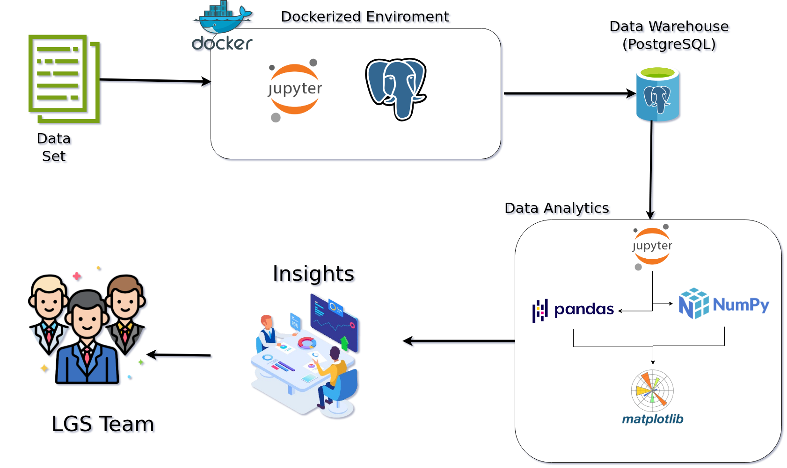

# PYTHON DATA ANALYTICS

## Introduction

London Gift Shop (LGS) is a UK-based online store that sells giftware. Many of its customers are wholesalers. The company has been running online shops for more than 10 years, but revenue has not grown in recent years.

LGS requested a Data Engineer from Jarvis Consulting to analyze their dataset, as the company lacks sufficient internal resources to take on additional projects. As the assigned Data Engineer, I was tasked with creating a proof of concept (PoC) to help the LGS marketing team better understand customer shopping behaviour. The marketing team will use these analytics to develop targeted marketing campaigns — including email, events, and targeted promotions — to attract both new and existing customers.

This PoC delivers a Jupyter Notebook with insights aimed at answering why LGS has not grown in revenue in recent years. The analysis attempts to answer the following questions:

1. What items are selling the most?

2. Who are the top customers and what do they have in common?

3. How can we group customers into meaningful segments?

4. What items are being returned?

5. What are the high seasons for revenue?

<!-- TODO: Describe the business context of this project in your own words.
     What does LGS do? What problem are they trying to solve with data analytics?
     What value does this project deliver to them? -->

<!-- TODO: Describe how LGS would use your analytic results.
     What decisions or actions do your findings enable? -->

### Technologies

This PoC was implemented using thje following technologies and tools:

- **Python** — primary programming language for all data processing and analytics
- **Jupyter Notebook** — interactive development environment used to write, run, and present analytics
- **Pandas** — core library for data loading, cleaning, transformation, and aggregation
- **NumPy** — used for numerical operations and array-based calculations
- **Matplotlib** — used for data visualization including histograms, line charts, bar charts, and box plots
- **psycopg2** — used to connect to and query the PostgreSQL data warehouse from Python
- **PostgreSQL (PSQL)** — data warehouse provisioned via Docker to store and query the retail transaction data
- **Docker** — used to provision and manage both the PostgreSQL and Jupyter Notebook containers in isolated environments

Finally the project is delievered as a Jupyter Notebook and executive presentation.

---

# Implementation

### Project Architecture

The project architecture was built on transaction data spanning 01/12/2009 to 09/12/2011, retrieved from a SQL file. That data was loaded into a PostgreSQL instance running inside a Docker container. A second Docker container ran a Jupyter Notebook image, and a Docker network was used to connect the two containers. From within the Jupyter Notebook, psycopg2 was used to pull the data from PostgreSQL database, which was then analyzed using Python, Pandas, and NumPy.

<!-- TODO: Insert your architecture diagram below. Replace the path with the actual location of your image. -->

# Data Analytics and Wrangling

> Notebook can be found here : [Jupyter Notebook](./python_data_wrangling/retail_data_analytics_wrangling.ipynb)     

## Key Findings & Business Recommendations
| #   | Insight               | Finding                                                                       | Business Action                                                    |
| --- | --------------------- | ----------------------------------------------------------------------------- | ------------------------------------------------------------------ |
| 1   | Revenue Concentration | Top 5% of customers (294) generate 52% of total revenue                       | Build VIP retention programme — losing one whale is costly         |
| 2   | Seasonal Peaks        | Revenue spikes every November, drops sharply in December                      | Align campaigns and inventory ahead of peak, lift off-peak months  |
| 3   | Top Products          | A small number of products drive the majority of revenue                      | Prioritize top products in all marketing and promotional activity  |
| 4   | At Risk Customers     | 754 customers haven't bought in 375 days, 86 Can't Lose customers going quiet | Launch re-engagement campaigns before they are permanently lost    |
| 5   | Customer Segments     | 843 Champions drive most revenue, 1,162 Loyals are next in line               | Upsell Loyals, protect Champions, deprioritize Hibernating segment |

The analysis was structured around four business questions to give the LGS marketing team a concrete basis for action:

- **Top-selling & Losing items** — by identifying which products generate the most volume and revenue, LGS can prioritize inventory and feature these products prominently in campaigns and promotions.
- **Customer whales** — identifying the highest-value customers and understanding what they have in common, enabling LGS to protect key relationships and target similar prospects.
- **Customer segmentation** — grouping customers by purchasing behaviour (e.g. RFM analysis) enables the marketing team to tailor messaging by segment rather than applying a one-size-fits-all approach.
- **Revenue seasonality**— pinpointing high-revenue periods allows LGS to time campaigns, stock levels, and promotional spend to align with natural buying peaks rather than working against them.

---

# **RFM Analysis:**
| Segment             | Customers | Action                       |
| ------------------- | --------- | ---------------------------- |
| Champions           | 843       | Retain & reward              |
| Loyal Customers     | 1,162     | Upsell to Champions          |
| Potential Loyalists | 737       | Nurture with targeted offers |
| Can't Lose          | 86        | Urgent win-back campaign     |
| At Risk             | 754       | Re-engagement campaign       |
| Need Attention      | 274       | Reactivate with promotions   |
| About to Sleep      | 383       | Send reminder campaigns      |
| Promising           | 119       | Onboard & educate            |
| New Customers       | 49        | Welcome & convert            |
| Hibernating         | 1,535     | Low priority — minimal spend |

**Champions (843 customers)**
- Bought 6 days ago on average, order 23x, spend £10,600
- These are your top 5% whales from earlier — protect them at all costs

**Loyal Customers (1,162 customers)**
- Bought 66 days ago, order 12x, spend £3,976
- Largest high-value group — biggest opportunity to upsell into Champions

**Can't Lose (86 customers)**
- Haven't bought in 319 days but historically ordered 17x and spent £5,670
- High value customers going quiet — urgent win-back needed

**At Risk (754 customers)**
- Haven't bought in 375 days, used to spend £1,156
- Slipping away — need a re-engagement campaign

**Hibernating (1,535 customers)**
- Largest segment, 464 days since last purchase, low spend
- Likely lost, not worth heavy investment

**RFM Take aways:**

> LGS has 843 Champions driving most revenue, 1,162 Loyals who could become Champions, but 754 At Risk and 86 Can't Lose customers quietly disappearing — and no retention strategy to stop it.

# Improvements

Given more time, the following enhancements would be prioritized:

1. **Interactive Dashboard** — replace static Matplotlib visualizations with an interactive dashboard using a tool such as Plotly Dash or Streamlit, allowing stakeholders to filter and explore the data by date range, product, or region without modifying code.

2. **Automated Data Pipeline** — replace the manual data loading process with a scheduled ETL pipeline so the data warehouse stays current automatically, removing the need for manual SQL file imports.

3. **Predictive Modelling** — extend the analysis from descriptive to predictive by building a churn-risk or demand forecasting model, enabling LGS to act on future trends rather than only interpret historical patterns.
