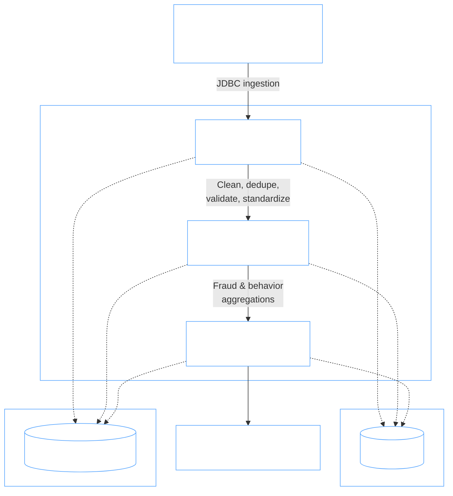
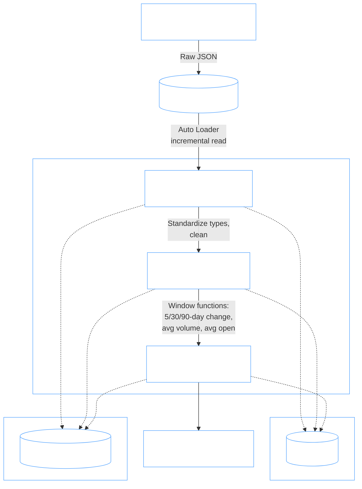

# Introduction

Organizations that rely on transactional and market data need trustworthy, analysis-ready datasets to answer business questions — whether that's detecting fraudulent activity in a payments system or tracking how a stock has moved over the past trading week, month, and quarter. Raw data rarely arrives in a usable state: it's inconsistent, duplicated, and untyped, and turning it into something an analyst or dashboard can consume requires a structured pipeline.

This project demonstrates two different approaches to building that pipeline in Databricks, both following a **Medallion (Bronze → Silver → Gold) architecture**, but using different ingestion and orchestration patterns:

1. **An ETL pipeline** that ingests over 13 million rows of financial transaction data from Azure SQL Database, cleans and integrates it, and produces gold-layer datasets used to investigate fraudulent activity and user behavior.
2. **A DLT (Databricks Lakeflow Declarative Pipelines) pipeline** that ingests daily stock market data for four tickers (AAPL, GOOG, MSFT, FGI) from the Alpha Vantage API, and produces gold-layer trend metrics powering a stock market analytics dashboard.

Core technologies used across both pipelines: **Databricks**, **Azure** (Azure SQL Database, Azure Data Lake Storage), **PySpark / Spark Structured APIs**, **Delta Lake**, **Unity Catalog**, **Delta Live Tables (DLT)**, **JDBC**, and the **Alpha Vantage REST API**.

# ETL Pipeline Implementation

## Dataset and Analytics Work

The dataset consists of financial transaction records — over **13 million rows** — originally loaded into an **Azure SQL Database** via VS Code, then ingested into Databricks for processing.

Work performed in this pipeline includes:
- Ingesting transaction data from Azure SQL Database into the Bronze layer via JDBC
- Silver-layer cleaning: type casting, deduplication, null handling, and standardization across source fields
- Gold-layer analysis answering business questions related to fraudulent activity and user behavior, including transaction timing patterns, customers with unusually high fraud rates, and behavioral anomalies relative to typical user activity
- A pipeline execution model where each layer only proceeds if the prior layer completes successfully, regenerating a fresh snapshot of the pipeline on each successful run

📓 Notebook: [`ETL Pipeline`](./notebook/ETL/)

## Architecture

- **Data Source**: Azure SQL Database (transaction records, loaded via VS Code)
- **Ingestion**: JDBC connection from Databricks into the Bronze layer
- **Storage**: Delta Lake tables backed by Azure Data Lake Storage
- **Catalog**: Unity Catalog, organizing tables into Bronze, Silver, and Gold schemas
- **Compute**: Databricks clusters running PySpark for distributed transformation
- **Orchestration**: Conditional, layer-by-layer execution — each stage (Bronze → Silver → Gold) runs only if the previous stage succeeds, with a new snapshot generated on each successful run
- **Consumption**: Gold tables feed a Databricks dashboard visualizing fraud patterns and user behavior

**Data flow:**
1. Transaction data ingested from Azure SQL Database via JDBC → written to the Bronze layer (raw, immutable)
2. Bronze data cleaned, deduplicated, standardized, and validated → written to the Silver layer
3. Silver data aggregated into fraud/behavior analytics datasets → written to the Gold layer
4. Gold tables queried by the dashboard layer for visualization

## Architecture Diagram

 

# DLT Pipeline Implementation

## Dataset and Analytics Work

The dataset consists of daily historical price and volume data for four tickers — **AAPL, GOOG, MSFT, and FGI** — retrieved from the **Alpha Vantage API** and stored as raw JSON files in a Unity Catalog Volume.

Work performed in this pipeline includes:
- Reading raw JSON files from the Volume into a Bronze streaming table via Auto Loader
- Silver-layer standardization: converting dates, prices, and volume fields into proper data types, with cleaned records managed by DLT using `@dp.table`
- Gold-layer feature engineering: a materialized view computing metrics such as average volume, last close, average open, and percent change over 5, 30, and 90 trading-day windows, used to power the stock market dashboard

📓 Notebook: [`DLT_Pipeline.ipynb`](./DLT_Pipeline.ipynb)

## Architecture

- **Data Source**: Alpha Vantage REST API (daily OHLCV data for AAPL, GOOG, MSFT, FGI)
- **Ingestion**: Raw JSON written to a Unity Catalog Volume, then read incrementally via Auto Loader
- **Pipeline Engine**: Databricks Lakeflow Declarative Pipelines (DLT) — tables and dependencies declared with `@dp.table`, execution and orchestration managed by Databricks
- **Storage**: Delta Lake tables backed by Azure Data Lake Storage
- **Catalog**: Unity Catalog, organizing tables into Bronze, Silver, and Gold schemas
- **Compute**: Databricks clusters running PySpark / Spark Structured APIs
- **Consumption**: Gold materialized view feeds a Databricks dashboard showing average volume, last close, percent change (5/30/90-day), average open, and related metrics

**Data flow:**
1. Daily data pulled from the Alpha Vantage API → written as raw JSON to a Unity Catalog Volume
2. Volume JSON files read incrementally by Auto Loader → materialized as a Bronze streaming table
3. Bronze data standardized and typed by DLT (`@dp.table`) → materialized as a Silver streaming table
4. Silver data aggregated using PySpark window functions → materialized as a Gold materialized view
5. Gold materialized view queried by the dashboard layer for visualization

Because the pipeline is built declaratively, dependencies between layers are inferred automatically from which tables each step reads — Databricks manages checkpointing, incremental processing, and execution order

## Architecture Diagram

# Future Improvement

1. **Pipeline monitoring and alerting** — Add monitoring for pipeline failures, processing latency, record counts, and data-quality violations across both pipelines, with automated alerts when abnormal behavior is detected.
2. **Scheduled, fully automated ingestion** — Move both pipelines from manual execution to scheduled jobs, so new transaction data and daily market data automatically flow through Bronze, Silver, and Gold and refresh the downstream dashboards without manual intervention.
3. **Expanded metrics and generalized ticker/source configuration** — Add further technical indicators (e.g. moving averages, RSI, volatility bands) to the DLT gold layer, and generalize both pipelines to support configurable ticker lists or additional data sources rather than hardcoded values.
4. **Predictive analytics** — Extend the curated Gold datasets into machine learning use cases, such as fraud-risk classification on the transaction data or price-movement forecasting on the stock market data.