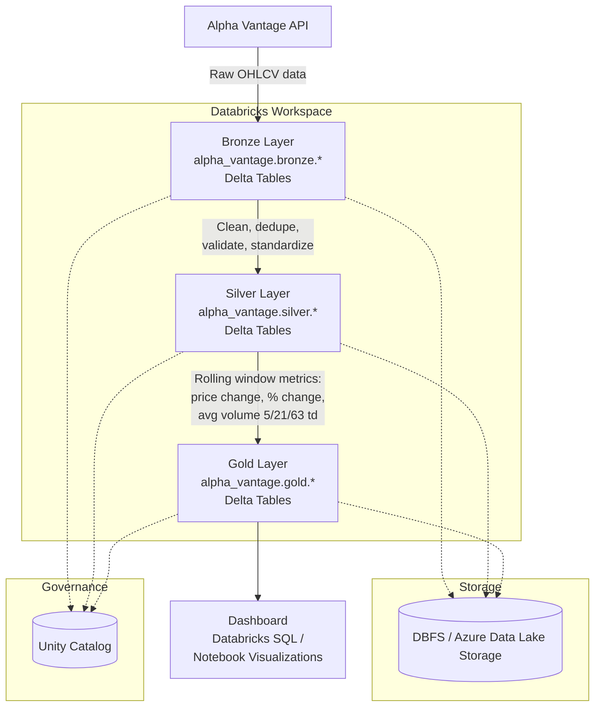

# Introduction

Financial analysts and retail investors rely on timely, trustworthy price and volume data to spot trends and make decisions. Raw market data feeds, however, are noisy — they arrive with duplicates, missing fields, inconsistent formatting, and no derived metrics like trend or momentum. This project addresses that gap by building an automated pipeline that ingests raw stock market data, progressively cleans and enriches it, and surfaces trend-ready metrics for a Yahoo Finance-style dashboard, so that end users can quickly assess how a stock has moved over the past trading week, month, and quarter without doing any manual data wrangling themselves.

The project pulls daily OHLCV (open, high, low, close, volume) data for four tickers — AAPL, GOOG, INHD, and FGI — from the Alpha Vantage API. The pipeline is built on **Databricks** using **PySpark** and **Delta Lake**, following a **Medallion (Bronze → Silver → Gold) architecture**:

- **Bronze**: raw, unmodified data as ingested from the Alpha Vantage API
- **Silver**: cleaned, deduplicated, type-enforced, and validated data
- **Gold**: business-ready aggregated tables with rolling price-change, percent-change, and volume-trend metrics (5, 21, and 63 trading-day windows), designed to power the final dashboard

Core technologies used: **Databricks**, **PySpark / Spark Structured APIs**, **Delta Lake**, and **Unity Catalog** for schema/table management (`alpha_vantage.bronze`, `alpha_vantage.silver`, `alpha_vantage.gold`).

# Databricks and Hadoop Implementation

## Dataset and Analytics Work

The dataset consists of daily historical price data for four tickers (**AAPL, GOOG, INHD, FGI**) sourced from the Alpha Vantage API, containing standard OHLCV fields (open, high, low, close, volume) indexed by trading date.

Work performed in this notebook includes:
- Data profiling (schema inspection, null counts, duplicate counts, summary statistics)
- Silver-layer cleaning: type casting, deduplication, null handling, standardization of column names/text fields, and filtering of invalid records (e.g. non-positive prices)
- Gold-layer feature engineering: rolling window calculations for price change, percent change, and average volume over 5, 21, and 63 trading-day windows (equivalent to ~1 week, ~1 month, and ~1 quarter of trading activity)

📓 Notebook: [`analysis.ipynb`](./analysis.ipynb)

## Architecture

The pipeline runs entirely on **Databricks**, using the following components:

- **Data Source**: Alpha Vantage REST API (daily OHLCV data)
- **Storage**: Delta Lake tables backed by DBFS / cloud object storage (Azure Data Lake Storage)
- **Catalog**: Unity Catalog, organizing tables into `alpha_vantage.bronze`, `alpha_vantage.silver`, and `alpha_vantage.gold` schemas
- **Compute**: Databricks clusters running PySpark for distributed transformation
- **Processing**: Spark Structured APIs (DataFrame API, Window functions) for cleaning and rolling-metric computation
- **Consumption**: Gold tables feed a dashboard (Databricks SQL / notebook visualizations) presenting price trend, percent change, and volume trend per symbol

**Data flow:**
1. Raw data pulled from Alpha Vantage API → written to `alpha_vantage.bronze.*` (as-is, immutable)
2. Bronze tables read, cleaned, validated, deduplicated → written to `alpha_vantage.silver.*`
3. Silver tables read, enriched with rolling-window trend/volume metrics → written to `alpha_vantage.gold.*`
4. Gold tables queried by the dashboard layer for visualization

## Architecture Diagram

# Future Improvement

1. **Automated data quality monitoring** — Introduce Delta Live Tables expectations (or Unity Catalog constraints) to systematically track and alert on data quality issues (nulls, out-of-range values, duplicates) rather than relying on manual profiling notebooks, and route rejected records to a `_quarantine` table instead of silently dropping them.

2. **Incremental/streaming ingestion** — Move from full-table overwrites to incremental ingestion using `MERGE INTO` (upserts) or Structured Streaming with Auto Loader, so new daily data can be appended without reprocessing the entire history, and the pipeline can run on a scheduled job rather than manual execution.

3. **Expanded metrics and additional tickers** — Add further technical indicators (e.g. moving averages, RSI, volatility/standard deviation bands) to the Gold layer, and generalize the pipeline to support an arbitrary list of tickers via configuration rather than hardcoded per-symbol variables.

4. **Production dashboard with drill-down** — Build out the dashboard into a fully interactive Databricks SQL dashboard (or embedded BI tool) with symbol selection, adjustable date ranges, and side-by-side multi-symbol comparison views, rather than static notebook visualizations.
