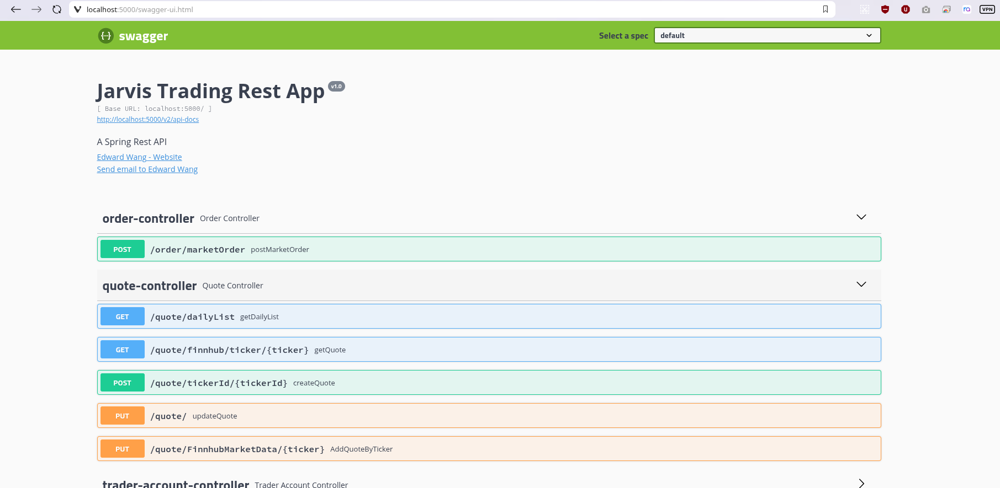
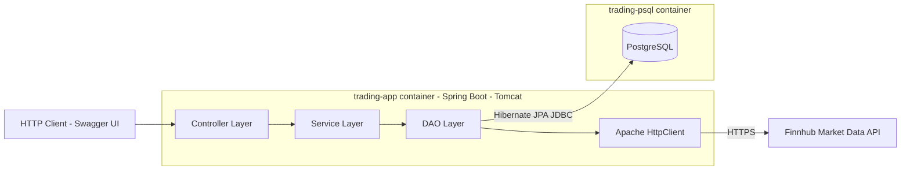
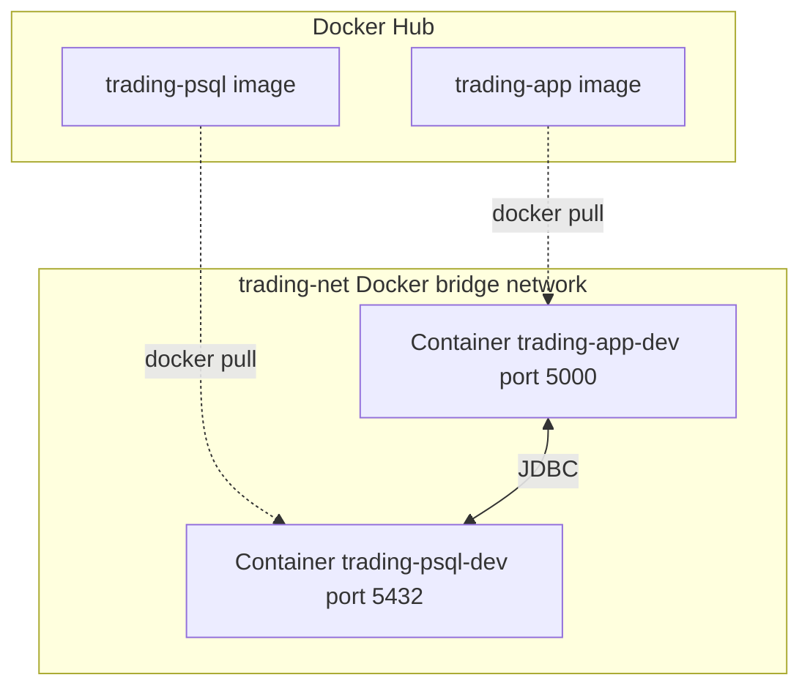

Table of contents
* [Introduction](#Introduction)
* [Quick Start](#Quick-Start)
* [Implementation](#Implementation)
* [Test](#Test)
* [Deployment](#Deployment)
* [Improvements](#Improvements)

# Introduction
This project was built as part of Jarvis Consulting Group's Sprint Boot kick-off ticket, which asked trainees to build a Spring Boot-based trading application on top of a relational (PSQL) data store, and then containerize it with Docker so it can be built and deployed consistently across environments.

The **Trading App** is a REST API that simulates a simplified securities trading platform. It allows the system to:
- Create and manage **traders** and their **accounts** (deposit/withdraw funds)
- Pull **real-time market quotes** for securities from an external market data provider and cache them locally
- Execute **market orders** (buy/sell) against a trader's account, validating funds and positions before filling an order

The technology stack includes:
- **Java 8** / **Spring Boot** (`spring-boot-starter-web`, `spring-boot-starter-data-jpa`) for the REST API and dependency injection
- **Hibernate / JPA** as the ORM layer, backed by **PostgreSQL** for persistence
- **Apache HttpClient** for outbound HTTP calls to the market data provider (Finnhub)
- **Springfox Swagger2 / Swagger UI** for interactive API documentation
- **JUnit 5** and **Mockito** for unit and integration testing
- **Docker** (multi-stage builds) to containerize both the application and the database, connected over a Docker bridge network

# Quick Start

### Prerequisites
- Docker (17.05+, for multi-stage build support)
- CentOS 7 (or any Docker-compatible host)
- A Finnhub API token (used by the app to fetch live quotes)

### Docker scripts

**1. Build the `trading-psql` image** (Postgres + schema initialization)
```bash
cd springboot/psql
docker build -t trading-psql .
```
This builds a Postgres 9.6-alpine image and copies in two initialization scripts (`Database_DDL.sql`, `Table_DDL.sql`) that Postgres runs automatically on first startup to create the `jrvstrading` database and its tables.

**2. Build the `trading-app` image** (Spring Boot application)
```bash
cd springboot
docker build -t trading-app .
```
This is a multi-stage build: stage one compiles the app into an executable (fat) jar using Maven, and stage two copies just that jar into a lightweight `eclipse-temurin:8-jre-alpine` runtime image.

**3. Create a Docker network** so the two containers can resolve each other by name
```bash
docker network create trading-net
```

**4. Start the containers**
```bash
# Start Postgres
docker run --name trading-psql-dev \
  -e POSTGRES_PASSWORD=password \
  -e POSTGRES_DB=jrvstrading \
  -e POSTGRES_USER=postgres \
  --network trading-net \
  -d -p 5432:5432 trading-psql

# Start the trading app
docker run --name trading-app-dev \
  -e "PSQL_URL=jdbc:postgresql://trading-psql-dev:5432/jrvstrading" \
  -e "PSQL_USER=postgres" \
  -e "PSQL_PASSWORD=password" \
  --network trading-net \
  -p 5000:8080 -t trading-app
```

### Try trading-app with Swagger UI
Once both containers are up, open a browser to:
```
http://localhost:5000/swagger-ui.html
```


# Implementation

## Architecture



Controller layer contains `QuoteController`, `TraderAccountController`, and `OrderController`. Service layer contains `QuoteService`, `TraderAccountService`, and `OrderService`. DAO layer contains the JPA repositories plus `MarketDataDao`.

- **Controller layer**: Handles incoming HTTP requests, deserializes request bodies/path variables into DTOs, and translates service-layer results (or exceptions) into HTTP responses with the appropriate status codes. The controllers in this app (`QuoteController`, `TraderAccountController`, `OrderController`) contain no business logic themselves — they delegate to the service layer and wrap failures as `ResponseStatusException` or a custom `ResourceNotFoundException`.
- **Service layer**: Contains the actual business rules — validating input, orchestrating multiple DAO calls within a single logical operation, and enforcing constraints (e.g. a trader can't be deleted while holding funds or open positions, a market order can't be filled without sufficient balance or position). Each service (`QuoteService`, `TraderAccountService`, `OrderService`) is a thin coordination layer between controllers and the DAO layer.
- **DAO layer**: Responsible for data access. Most DAOs (`TraderJpaRepoDao`, `AccountJpaRepoDao`, `PositionJpaRepoDao`, `SecurityOrderJpaRepoDao`, `QuoteJpaRepoDao`) extend Spring Data JPA repositories, giving CRUD operations against PostgreSQL for free. `MarketDataDao` is the exception — it doesn't talk to the database at all, but instead uses Apache HttpClient to call the Finnhub REST API and deserializes the JSON response into a `Quote` object.
- **SpringBoot: WebServlet/Tomcat and IoC**: Spring Boot embeds an Apache Tomcat servlet container, so the app runs as a standalone executable jar rather than requiring an external application server — Tomcat handles incoming HTTP connections and routes them into the Spring `DispatcherServlet`. Spring's IoC container manages the lifecycle of all `@Service`, `@Component`, `@RestController`, and `@Configuration` beans, wiring dependencies together automatically via constructor injection (`@Autowired`) rather than requiring manual instantiation.
- **PSQL and Finnhub**: PostgreSQL is the system of record for traders, accounts, security orders, and a local cache of quote data (see the `quote` table). Finnhub is the external market data provider — when a fresh price is needed, the app calls Finnhub over HTTPS and can persist the result into the `quote` table, so subsequent reads can be served from Postgres instead of re-hitting the external API every time.

## REST API Usage

### Swagger
Swagger is a set of tools for designing, building, and documenting REST APIs, built around the OpenAPI Specification. It generates interactive, always-up-to-date documentation directly from the annotated controller code, letting developers and API consumers browse endpoints and execute real test calls from a browser without needing a separate client like Postman. This benefits both the developers building the API (fast manual testing during development) and anyone integrating with it (self-service, accurate documentation).

### Quote Controller
Market data originates from **Finnhub**, an external market data API. `QuoteController` exposes endpoints to fetch a live quote directly from Finnhub, persist it into the local PSQL `quote` table (acting as a cache), update an existing cached quote, and list everything currently cached in the database.
- `GET /quote/finnhub/ticker/{ticker}`: fetches a live quote for the given ticker directly from Finnhub (not from the database).
- `PUT /quote/FinnhubMarketData/{ticker}`: fetches a live quote from Finnhub for the given ticker and saves/upserts it into the local `quote` table.
- `PUT /quote/`: updates an existing quote row in the database with new field values (price, change, high/low, etc.) supplied in the request body.
- `POST /quote/tickerId/{tickerId}`: fetches a quote from Finnhub for the given ticker and creates a new row for it in the `quote` table.
- `GET /quote/dailyList`: returns every quote currently cached in the local `quote` table.

### Trader Controller
`TraderAccountController` manages trader and account information — creating a trader (which also provisions a linked account with a starting balance of 0), deleting a trader, and depositing or withdrawing funds from a trader's account.
- `POST /trader/`: creates a new trader (and an associated account) from a JSON request body.
- `POST /trader/firstname/{firstname}/lastname/{lastname}/dob/{dob}/country/{country}/email/{email}`: creates a new trader (and associated account) using path variables instead of a request body.
- `DELETE /trader/traderId/{traderId}`: deletes a trader, but only if their account balance is 0 and they hold no open positions.
- `PUT /trader/deposit/traderId/{traderId}/amount/{amount}`: deposits funds into the trader's account and returns the updated account.
- `PUT /trader/withdraw/traderId/{traderId}/amount/{amount}`: withdraws funds from the trader's account and returns the updated account.

### Order Controller
`OrderController` is responsible for executing market orders (buy/sell) against a trader's account. It validates the order, checks account balance (for buys) or existing position size (for sells), fills the order at the current market price, and updates the account balance accordingly.
- `POST /order/marketOrder`: submits a market order (buy or sell) for a given trader, ticker, and size; returns the resulting `SecurityOrder` with its final status (`FILLED` or `REJECTED`).

### App controller
There is currently no separate top-level "App" controller in this project — application-wide configuration (data source, market data client, Swagger) is handled instead through `@Configuration` classes (`AppConfig`, `DataSourceConfig`, `MarketDataConfig`, `SwaggerConfig`) rather than a dedicated REST controller.

### Optional (Dashboard controller)
Not implemented in this iteration of the project.

# Test
The application is tested using **JUnit 5** together with **Mockito** for mocking dependencies. Testing is split into two categories:
- **Unit tests** (e.g. `OrderServiceTest`, `QuoteServiceTest`, `TraderAccountServiceTest`) mock out the DAO and downstream service dependencies with Mockito, isolating and verifying the business logic in each service method (validation rules, branching for buy vs. sell, error handling) without touching a real database or external API.
- **Integration tests** (e.g. `OrderServiceIntTest`, `QuoteServiceIntTest`, `QuoteJpaRepoDaoIntegrationTest`, `MarketDaoTest`) exercise the real Spring context, a real (test) PostgreSQL database, and/or a live call to Finnhub, to confirm the layers work correctly together end-to-end.


# Deployment



Images are published to Docker Hub as `fredeemnetu/trading-app:latest` and `fredeemnetu/trading-psql:latest`.

Two images are built and pushed independently to Docker Hub:

- **`trading-psql`**: built `FROM postgres:9.6-alpine`. Two SQL scripts are copied into `/docker-entrypoint-initdb.d/` — `1-database.sql` (creates the `jrvstrading` database and grants) and `2-table_ddl.sql` (creates the `trader`, `account`, `quote`, and `security_order` tables, plus a `position` view). Postgres' entrypoint script automatically runs every file in that directory, in filename order, the first time the container starts against an empty data directory — this is what initializes the schema with no manual setup required.
- **`trading-app`**: built with a Maven multi-stage Dockerfile. The first stage (`maven:3.6-jdk-8-slim`) compiles the source and packages an executable fat jar via `spring-boot-maven-plugin`. The second stage (`eclipse-temurin:8-jre-alpine`) copies only that jar into a minimal JRE runtime image and runs it with `java -jar`, keeping the final image small since it excludes Maven, source code, and build tooling.

Both containers are attached to a shared `trading-net` Docker bridge network so `trading-app` can reach `trading-psql` by container name (`trading-psql-dev`) rather than needing a hardcoded IP.

# Improvements
If given more time, the following areas would be improved:
1. **Externalize secrets properly** — the Finnhub API token and database credentials currently live in `application.properties`/plain environment variables; these should move to a secrets manager (or at minimum `.env` files excluded from version control) rather than being passed as plaintext `-e` flags on `docker run`.
2. **Add a `docker-compose.yml`** to replace the multi-step manual `docker network create` / `docker run` sequence with a single `docker-compose up`, making local setup faster and less error-prone.
3. **Add a dedicated Dashboard controller** to expose aggregate views (e.g. a trader's total portfolio value across all positions) rather than requiring API consumers to stitch together multiple endpoint calls themselves.
4. **Improve error handling consistency** — some service methods throw `IllegalStateException` for what are really "not found" or "bad request" conditions; standardizing on a consistent exception hierarchy (as already started with `ResourceNotFoundException`) would make the API's error responses more predictable.
5. **Add code coverage reporting** (e.g. JaCoCo integrated into the Maven build) so test coverage is tracked automatically as part of CI rather than measured ad hoc.